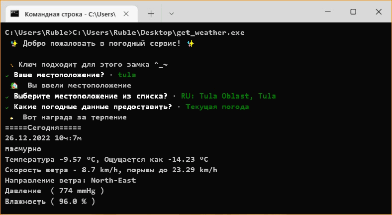
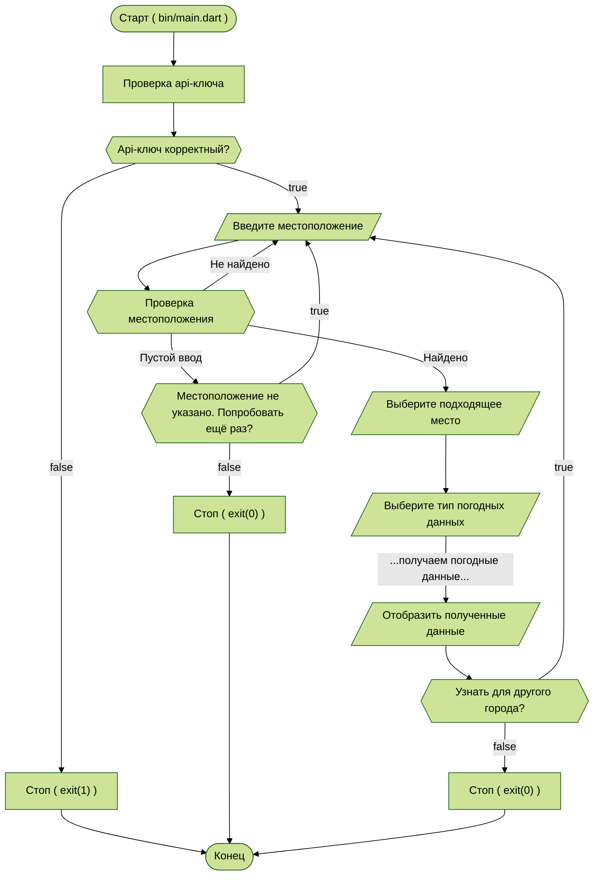
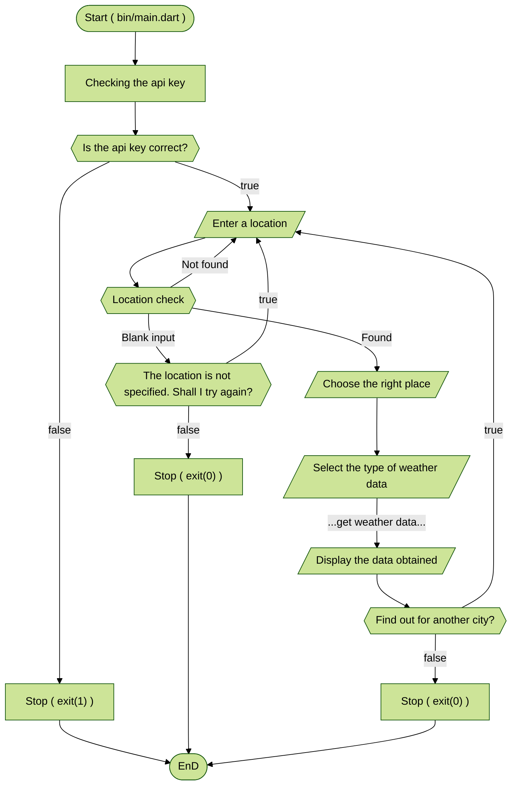

A sample command-line application designed to retrieve weather data
with an entrypoint in `bin/`, library code in `lib/`.



A detailed analysis of this application is presented as an article and can be found here:

* [![habr_badge]][habr_link]
* [![medium_badge]][medium_link]

You can start the application by using the command:
```shell
dart run --define="API_WEATHER=YOUR_APIKEY" bin/main.dart
```

Compile into an executable file, e.g. `.exe`:
```shell
dart compile exe bin/main.dart --define="API_WEATHER=YOUR_APIKEY"
```

The block diagram of the application is shown below:

<details><summary>In Russian (Click to open)</summary>



</details>



<!---->
[habr_badge]: https://img.shields.io/badge/habr-RU-F9DFCF?style=plastic&logo=habr
[habr_link]: https://habr.com/ru/post/708854/
[medium_badge]: https://img.shields.io/badge/medium-EN-C8A2C8?style=plastic&logo=medium
[medium_link]: https://medium.com/@pack.ruble/how-to-create-a-console-application-in-dart-using-the-weather-pack-package-68ed814f1903
