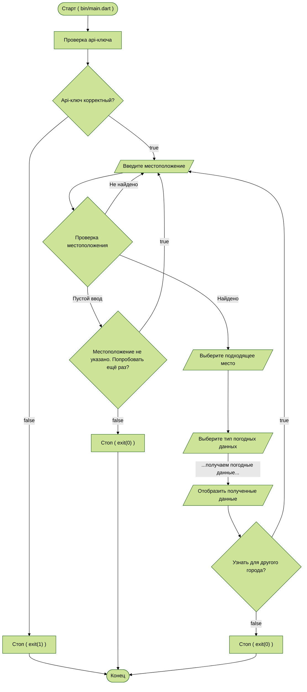

A sample command-line application designed to retrieve weather data 
with an entrypoint in `bin/`, library code in `lib/`.

<!--
TODO: Подробный разбор данного приложения представлен здесь (RU):

-->

You can start the application by using the command:
```shell
dart run --define="API_WEATHER=YOUR_APIKEY" bin/main.dart
```

Compile into an executable file, e.g. `.exe`:
```shell
dart compile exe bin/main.dart --define="API_WEATHER=YOUR_APIKEY"
```

The block diagram of the application is shown below (RU):

